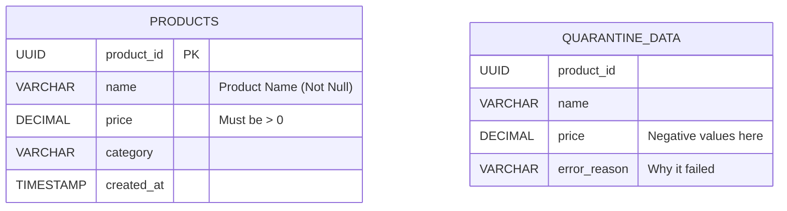

# SyHa Data Engineering Pipeline

## Overview
This project implements a high-performance ETL (Extract – Transform – Load) pipeline for an E-Commerce system using Python. It addresses common bottlenecks in synthetic data generation and database loading.
- Extracts fake data using Multiprocessing (Parallel CPU cores).
- Transforms and cleans data using Pandas with a Dead Letter Queue strategy.
- Loads data into PostgreSQL using the binary COPY protocol.

## ERD (Entity Relationship Diagram)



### Schema Details

| Table | Column | Description |
| :--- | :--- | :--- |
| **products** | product_id, name, price, category, created_at | Main product inventory (Clean Data) |
| **quarantine** | product_id, name, price, error_reason | Rejected rows for audit (Dirty Data) |

## ETL Pipeline

1. **Extract**
   - Generates synthetic E-Commerce data using Faker.
   - Utilizes `multiprocessing` to run on multiple CPU cores in parallel (~16x speedup).

2. **Transform**
   - Cleans and validates data using Pandas and Vectorized operations.
   - **Dead Letter Queue:** Instead of deleting bad data, invalid rows (e.g., negative price) are separated and saved to `data/quarantine/` for inspection.

3. **Load**
   - Connects to PostgreSQL using `psycopg2`.
   - Uses `COPY ... FROM STDIN` for bulk insertion, significantly faster than standard `INSERT`.

## Environment Variables

Create a `.env` file or configure `config/settings.py`:

```
DB_HOST=localhost
DB_NAME=postgres
DB_USER=postgres
DB_PASSWORD=password
```

## Dependency Management (Poetry)

```bash
# Install dependencies
poetry install

# processing pipeline
poetry run python main.py
```

## Conclusion
This project demonstrates a production-grade approach to handling "garbage" data and optimizing performance for large-scale data ingestion tasks.
